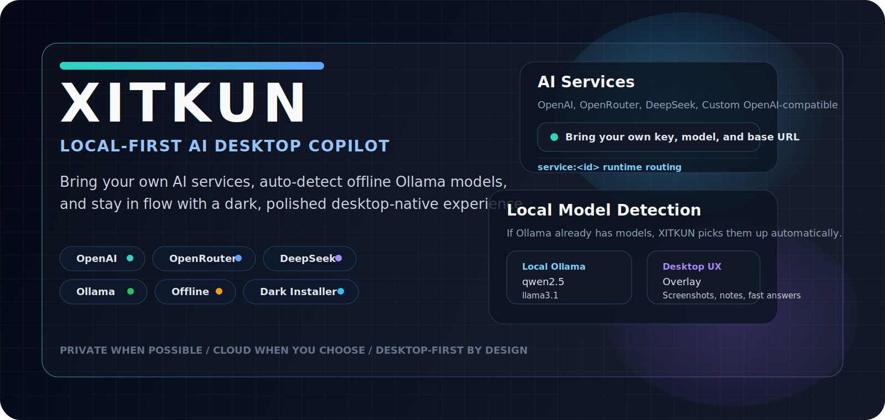
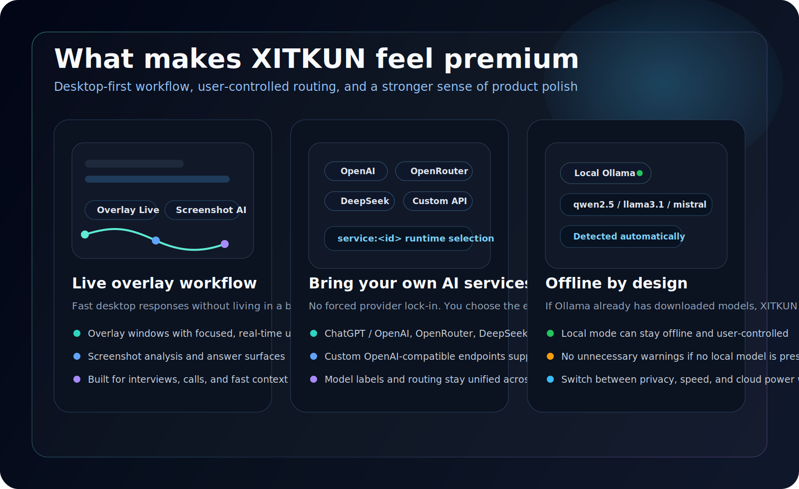
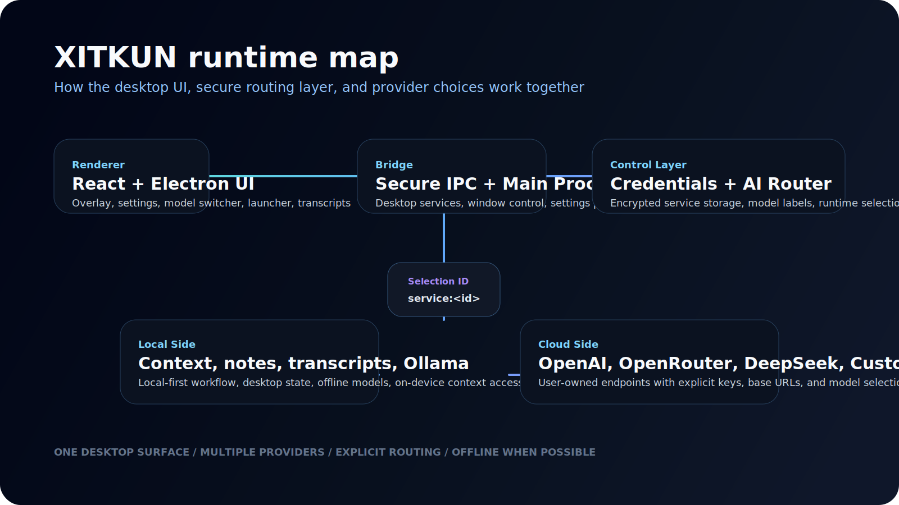
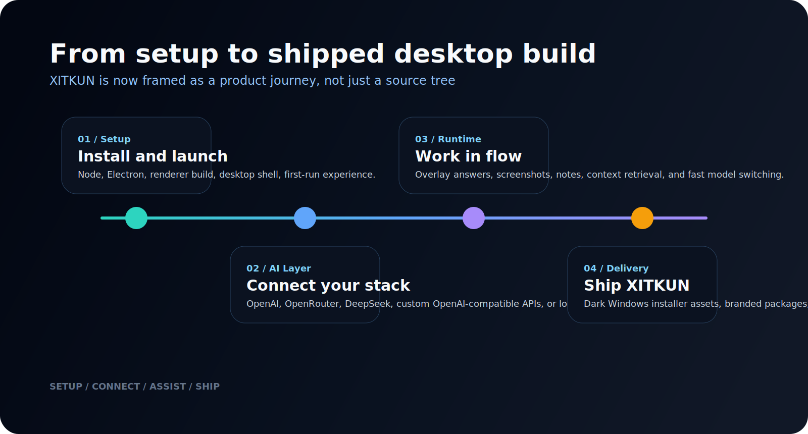

<p align="center">
  
</p>

<p align="center">
  
</p>

<p align="center">
  <a href="https://github.com/Krekker0101/NATE-1">
    
  </a>
  <a href="https://github.com/Krekker0101/NATE-1/releases">
    
  </a>
  <a href="LICENSE">
    
  </a>
  <a href="https://github.com/Krekker0101/NATE-1/commits/main">
    
  </a>
</p>

<p align="center">
  <a href="https://github.com/Krekker0101/NATE-1">
    
  </a>
  <a href="https://tajik-develop.yzz.me">
    
  </a>
  <a href="https://github.com/Krekker0101/NATE-1/issues">
    
  </a>
</p>

<p align="center">
  <strong>XITKUN</strong> is a dark, local-first AI desktop copilot for meetings, interviews, coding pressure, screenshots, transcripts, and fast decision-making.
  <br />
  You bring the models. XITKUN brings the desktop experience, routing layer, local workflow, and sharper product feel.
</p>

> [!IMPORTANT]
> XITKUN is intentionally built around user-controlled AI routing.
> You can use your own `ChatGPT / OpenAI`, `OpenRouter`, `DeepSeek`, or any `OpenAI-compatible` endpoint, and if local `Ollama` models already exist, they can be used offline without forced cloud dependency.

## Product Manifest

XITKUN is not trying to be another generic "AI app".
It is being shaped into a desktop-native assistant with three priorities:

- **Control** over providers, keys, endpoints, and runtime routing
- **Speed** during live workflows where context switching destroys momentum
- **Polish** in the places most desktop projects usually ignore: naming, packaging, installer quality, and overall feel

<p align="center">
  
</p>

## Why It Stands Out

<table>
  <tr>
    <td width="33%" valign="top">
      <h3>Desktop-First</h3>
      <p>Overlay workflow, fast switching, local context, and a UI shaped for active work instead of tab juggling.</p>
    </td>
    <td width="33%" valign="top">
      <h3>Provider Freedom</h3>
      <p>Bring your own OpenAI, OpenRouter, DeepSeek, or custom OpenAI-compatible service without hard-coded lock-in.</p>
    </td>
    <td width="33%" valign="top">
      <h3>Offline-Aware</h3>
      <p>When Ollama models already exist, they are detected automatically and can stay local and quiet.</p>
    </td>
  </tr>
  <tr>
    <td width="33%" valign="top">
      <h3>Product Polish</h3>
      <p>`XITKUN` branding, stronger packaging, dark installer visuals, and a more cohesive release surface.</p>
    </td>
    <td width="33%" valign="top">
      <h3>Live Workflow Utility</h3>
      <p>Screenshots, transcripts, quick answers, contextual assistance, and real-time desktop usage patterns.</p>
    </td>
    <td width="33%" valign="top">
      <h3>Local-First Intent</h3>
      <p>Context and desktop behavior are structured to stay close to the machine and the user, not hidden behind a browser stack.</p>
    </td>
  </tr>
</table>

## Capability Grid

| Domain | What XITKUN gives you |
| --- | --- |
| `AI Services` | Add your own `ChatGPT / OpenAI`, `OpenRouter`, `DeepSeek`, or custom OpenAI-compatible service with key, base URL, and model. |
| `Ollama` | Detect local models automatically and use them offline when available. |
| `Overlay UX` | Fast desktop-native assistance for meetings, interviews, focused sessions, and quick response loops. |
| `Screenshot Workflows` | Capture and route visual context into the active model path. |
| `Transcription + Context` | Keep notes, contextual workflow memory, and transcript-oriented features close to the desktop flow. |
| `Shipping` | Build and package `XITKUN` as a branded desktop app with Windows installer and portable outputs. |

## AI Routing

| Route | Status | Notes |
| --- | --- | --- |
| `ChatGPT / OpenAI` | Supported | Official OpenAI API with your own key and selected model. |
| `OpenRouter` | Supported | OpenAI-compatible gateway for multi-model access. |
| `DeepSeek` | Supported | DeepSeek via its OpenAI-compatible endpoint style. |
| `Custom OpenAI-compatible` | Supported | Bring your own endpoint, base URL, and model naming. |
| `Ollama` | Supported | Local model detection and offline-capable usage. |

<p align="center">
  
</p>

## Architecture Mindset

XITKUN is structured more like a desktop product than a simple AI wrapper:

- `Renderer UI` handles overlay surfaces, settings, selectors, and interaction flow
- `Secure IPC + Electron main` bridges UI and desktop-native operations
- `Credentials + AI router` manage service storage, model identities, and runtime switching
- `Local context layer` keeps transcripts, notes, and on-device workflow state close to the user
- `Provider layer` gives a clean split between cloud endpoints and local Ollama routing

That split matters because it keeps the app flexible:

- cloud when the user chooses cloud
- local when the machine already has what it needs
- one consistent UI above both

## Designed For Real Use

<details open>
<summary><strong>Live meetings and calls</strong></summary>

- Overlay-oriented experience instead of full-window interruption
- Quick switching while a conversation is still moving
- Better fit for note-heavy and decision-heavy sessions

</details>

<details open>
<summary><strong>Interviews and coding pressure</strong></summary>

- Faster context access during problem-solving
- Screenshot capture for visual debugging or prompt grounding
- Multiple model routes depending on privacy, cost, or capability

</details>

<details open>
<summary><strong>Local-first users</strong></summary>

- Ollama auto-detection when models are already downloaded
- Less forced dependence on hosted providers
- Cleaner path to offline-capable assistance

</details>

<p align="center">
  
</p>

## Build and Ship

```bash
# Install dependencies
npm install

# Run the app in development
npm run app:dev

# Build the renderer
npm run build

# Build Electron main/preload
npm run build:electron

# Build full desktop packages
npm run dist

# Build Windows installer + portable output
npm run dist:win
```

## Repo Layout

```text
src/                 Renderer UI, settings, model switching, analytics, overlay surfaces
electron/            Main process, IPC, credentials, runtime helpers, desktop integrations
native-module/       Native and Rust-backed functionality
assets/              Product icons, installer assets, README visuals, packaging resources
scripts/             Build helpers, packaging helpers, asset generation
release/             Generated desktop artifacts
```

## Recent Product-Level Upgrades

- `XITKUN` branding applied across packaged artifacts and visible app surfaces
- New `AI Services` layer for user-supplied providers instead of hard-coded visible model vendors
- Automatic `Ollama` local model detection for offline usage
- Cleaner runtime model labeling across selectors and UI surfaces
- Improved Windows packaging with darker, more intentional installer visuals
- Stronger repository presentation and documentation assets

## Product Philosophy

> [!NOTE]
> XITKUN aims to feel like a product that respects the user's machine, time, and control surface.

That means:

- local-first where it makes sense
- configurable where lock-in usually happens
- visually intentional instead of generic
- practical enough to ship, not just demo

## Tech Stack

| Area | Stack |
| --- | --- |
| Shell | Electron |
| Frontend | React, TypeScript, Vite, Tailwind |
| Desktop Runtime | Electron main process, preload, IPC, desktop integrations |
| AI Runtime | OpenAI-compatible APIs and Ollama local model routing |
| Native Work | Rust-backed/native desktop and audio tooling |
| Packaging | Electron Builder with branded Windows installer flow |

## License

This repository is licensed under the **GNU AGPL v3.0-only** license.

- Full text: [LICENSE](LICENSE)
- If you distribute a modified version, AGPL requires corresponding source availability under the same license family

## Links

- Repository: [Krekker0101/NATE-1](https://github.com/Krekker0101/NATE-1)
- Releases: [GitHub Releases](https://github.com/Krekker0101/NATE-1/releases)
- Issues: [GitHub Issues](https://github.com/Krekker0101/NATE-1/issues)
- Portfolio: [tajik-develop.yzz.me](https://tajik-develop.yzz.me)
