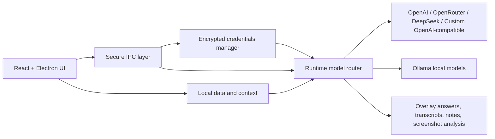

<p align="center">
  
</p>

<p align="center">
  <a href="https://github.com/Krekker0101/NATE-1">
    
  </a>
  <a href="LICENSE">
    
  </a>
  <a href="https://github.com/Krekker0101/NATE-1/commits/main">
    
  </a>
  <a href="https://github.com/Krekker0101/NATE-1">
    
  </a>
</p>

<p align="center">
  <a href="https://github.com/Krekker0101/NATE-1/releases">
    
  </a>
  <a href="https://tajik-develop.yzz.me">
    
  </a>
  <a href="https://github.com/Krekker0101/NATE-1/issues">
    
  </a>
</p>

<p align="center">
  <strong>XITKUN</strong> is a dark, local-first AI desktop copilot for meetings, interviews, live problem-solving, and focused workflows.
  <br />
  Bring your own AI services, auto-detect offline Ollama models, and keep the experience fast, polished, and desktop-native.
</p>

> [!IMPORTANT]
> XITKUN is designed around user-controlled routing. You choose whether answers come from local Ollama models or your own cloud APIs such as OpenAI, OpenRouter, DeepSeek, or any OpenAI-compatible endpoint.

## Why XITKUN Feels Different

<table>
  <tr>
    <td width="50%" valign="top">
      <h3>Bring Your Own AI</h3>
      <p>Add ChatGPT/OpenAI, OpenRouter, DeepSeek, or any OpenAI-compatible API with your own key, base URL, and model selection.</p>
    </td>
    <td width="50%" valign="top">
      <h3>Offline Local Models</h3>
      <p>If Ollama already has downloaded models, XITKUN detects them automatically and lets them work locally without noisy setup friction.</p>
    </td>
  </tr>
  <tr>
    <td width="50%" valign="top">
      <h3>Overlay-First Workflow</h3>
      <p>Built for real-time usage: live meetings, coding interviews, screenshot analysis, quick responses, and focused desktop assistance.</p>
    </td>
    <td width="50%" valign="top">
      <h3>Polished Desktop Delivery</h3>
      <p>Electron packaging, custom branding, stronger installer flow, dark Windows installer assets, and production-ready desktop build paths.</p>
    </td>
  </tr>
</table>

## Product Snapshot

| Layer | What it gives you |
| --- | --- |
| `AI Services` | Connect OpenAI, OpenRouter, DeepSeek, or any OpenAI-compatible service with your own API key and model. |
| `Ollama Auto-Detect` | Pick up locally downloaded Ollama models automatically and use them offline. |
| `Desktop Assistant UX` | Overlay windows, fast model switching, screenshot capture, and live assistance workflows. |
| `Local Context` | Keep transcripts, notes, and contextual workflow data on-device wherever possible. |
| `Build + Packaging` | Modern Electron build pipeline, Windows installer generation, and branded release artifacts for `XITKUN`. |

## AI Routing Matrix

| Route | Status | Purpose |
| --- | --- | --- |
| `OpenAI / ChatGPT` | Supported | Connect official OpenAI endpoints with your own key and chosen model. |
| `OpenRouter` | Supported | Route through multi-model cloud access with your own account. |
| `DeepSeek` | Supported | Use DeepSeek through its OpenAI-compatible API surface. |
| `Custom OpenAI-Compatible` | Supported | Point XITKUN at your own OpenAI-like endpoint and keep control of the stack. |
| `Ollama` | Supported | Detect local models automatically and run offline if they are already installed. |

## System Architecture



## Core Experience

- Use a desktop-native AI copilot instead of a browser tab maze.
- Route requests to your own providers instead of being locked into one baked-in model list.
- Let Ollama stay silent and useful in the background when local models already exist.
- Switch between local and cloud modes depending on privacy, speed, or cost.
- Package the app into a polished `XITKUN` Windows installer and portable build.

## Tech Stack

| Area | Stack |
| --- | --- |
| Shell | Electron |
| Frontend | React, TypeScript, Vite, Tailwind |
| Desktop Runtime | Electron main process, IPC, native desktop integrations |
| Local Storage | Desktop-managed local data and settings flows |
| AI Routing | OpenAI-compatible APIs plus Ollama local model support |
| Native Work | Rust-backed and native desktop/audio tooling |

## Quick Start

```bash
npm install
npm run app:dev
```

<details>
<summary><strong>Build commands</strong></summary>

```bash
# Production renderer build
npm run build

# Electron main/preload build
npm run build:electron

# Full desktop packaging
npm run dist

# Windows-focused packaging
npm run dist:win
```

</details>

<details>
<summary><strong>Development flow</strong></summary>

```bash
# Start Vite + Electron together
npm run app:dev

# Watch Electron TypeScript only
npm run watch

# Production-style Electron run
npm run electron:build
```

</details>

## Repository Layout

```text
src/                 Renderer UI, screens, model selection, settings, analytics
electron/            Main process, IPC, credentials, updates, local runtime services
native-module/       Native and Rust-backed functionality
assets/              Icons, packaging resources, installer visuals, brand assets
scripts/             Build helpers, packaging helpers, release preparation
release/             Generated packaged artifacts
```

## Notable Project Upgrades

- `XITKUN` product branding applied across app surfaces and packaged artifacts
- New AI services system for user-owned provider setup instead of hard-coded cloud entries
- Automatic Ollama model discovery for offline use
- Stronger Windows packaging with a cleaner installer configuration
- Custom dark installer sidebars generated as project assets
- Cleaner model labeling and selection flows across the desktop UI

## Privacy and Control

> [!NOTE]
> XITKUN is local-first, not cloud-forced.
> If you add cloud APIs, routing becomes explicit and user-directed.
> If you keep things on Ollama, the workflow can stay local and offline.

This project is aimed at people who want a desktop copilot that feels intentional:

- private where possible
- configurable where needed
- fast to operate during live workflows
- modern enough to ship as a real application, not a prototype shell

## License

This repository is licensed under the **GNU AGPL v3.0-only** license.

- Read the full license in [LICENSE](LICENSE)
- If you distribute a modified version, the AGPL requires preserving source availability under the same license terms

## Links

- Repository: [Krekker0101/NATE-1](https://github.com/Krekker0101/NATE-1)
- Portfolio: [tajik-develop.yzz.me](https://tajik-develop.yzz.me)
- Issues: [GitHub Issues](https://github.com/Krekker0101/NATE-1/issues)
- Releases: [GitHub Releases](https://github.com/Krekker0101/NATE-1/releases)
